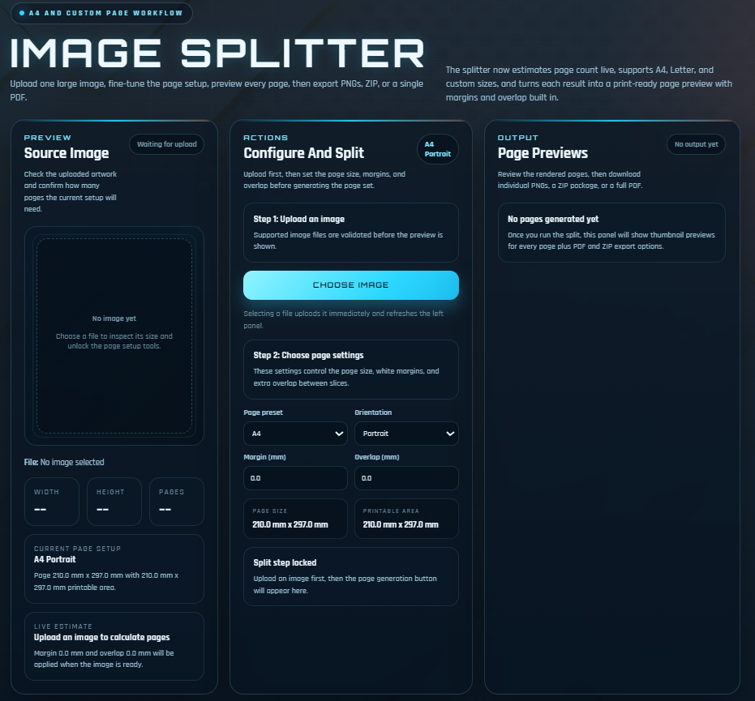
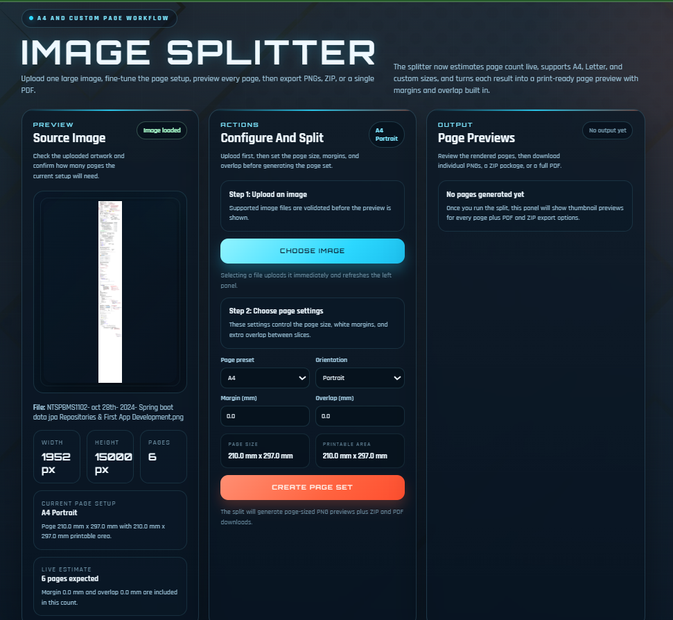
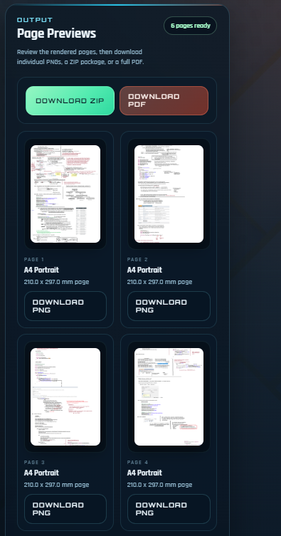

# 🖼️ Image Splitter Web Application

A Java Servlet-based web application that converts large images into multiple printable pages.

## 📸 Application Screenshots

### Home Page

### Upload Image

### Generated Page Preview

### PDF Export

# 🖼️ Image Splitter Web Application

A Java Servlet-based web application that converts large images into multiple printable pages. The application automatically splits an image into A4, Letter, or Custom-sized pages while preserving image quality and providing print-ready output.

## ✨ Features

* Upload any large image
* Split images into multiple printable pages
* Support for:

  * A4 Paper Size
  * Letter Paper Size
  * Custom Page Sizes
* Portrait and Landscape orientation
* Custom page margins
* Adjustable page overlap
* Live page count estimation
* Image preview before processing
* Generate page-by-page PNG files
* Download individual pages
* Export all pages as ZIP
* Export all pages as PDF
* Modern responsive user interface

---

## 🛠️ Technologies Used

### Backend

* Java
* Servlet API
* JSP

### Libraries

* Apache PDFBox
* Java ImageIO

### Frontend

* HTML5
* CSS3
* JavaScript

### Server

* Apache Tomcat

---

## 📂 Project Structure

src/

└── com.pack1/

├── DownloadServlet.java

├── ImageInfoServlet.java

├── SliceServlet.java

├── PdfServlet.java

├── ZipServlet.java

├── SliceLayout.java

├── SliceSettings.java

└── ImageSplitterUtil.java

WebContent/

├── index.jsp

├── uploads/

├── output/

└── images/

---

## 🚀 How It Works

1. Upload an image.
2. Select page size:

   * A4
   * Letter
   * Custom
3. Choose orientation:

   * Portrait
   * Landscape
4. Configure:

   * Margin
   * Overlap
5. Generate page set.
6. Preview generated pages.
7. Download:

   * Individual PNG pages
   * ZIP package
   * PDF document

---

## 📸 Example Use Cases

* Poster Printing
* Banner Printing
* Large Wall Art
* Engineering Drawings
* Maps
* Educational Charts
* Blueprint Printing

---

## ⚙️ Installation

### Prerequisites

* Java 8 or higher
* Apache Tomcat 9+
* Maven (optional)

### Steps

1. Clone the repository:

git clone https://github.com/yourusername/image-splitter.git

2. Import the project into Eclipse or IntelliJ IDEA.

3. Add required dependencies:

* Servlet API
* Apache PDFBox

4. Deploy the project to Apache Tomcat.

5. Start the server.

6. Open:

http://localhost:8080/ImageSplitter

---

## 📄 Output Formats

### PNG

Downloads each generated page as a separate image.

### ZIP

Downloads all generated pages in a single ZIP archive.

### PDF

Combines all generated pages into a single PDF document.

---

## 🔒 Security Features

* File name validation
* Session-based file tracking
* Safe file storage
* Input validation
* Error handling for invalid uploads

---

## 🌟 Future Improvements

* Drag & Drop Upload
* Multiple Image Upload
* PDF Upload Support
* Custom DPI Selection
* Print Marks and Crop Marks
* Cloud Storage Integration
* Image Compression Options
* Dark/Light Theme Switcher

---

## 👨‍💻 Author

Developed by Shahrukh

If you like this project, don't forget to ⭐ the repository.

---
